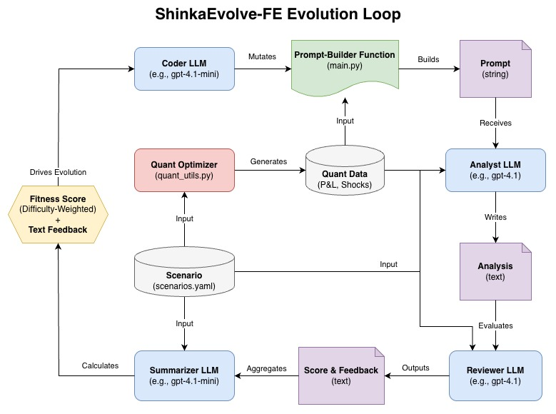

# ShinkaEvolve-FE (Financial Engineering)

ShinkaEvolve-FE is a Proof-of-Concept financial risk-analysis system built on top of
[SakanaAI’s ShinkaEvolve](https://github.com/SakanaAI/ShinkaEvolve). It demonstrates how Shinka can evolve a reusable prompt-building function that automatically generates consistent, scenario-specific hedge-weakness analysis using LLMs. The system does not replace pricing or optimization. Instead, it automates the natural-language analysis that normally follows quantitative stress results.

In this POC, a simple Greek-based optimization model produces worst-case multi-factor crisis shocks under realistic per-factor sigma limits. Shinka consumes these quantitative outputs and produces structured prompts that guide an LLM to explain why the stress scenario is harmful, how hedges behave under crisis correlations, and which risk factors dominate the loss.

The quality of each analysis is then evaluated by a separate reviewer LLM, which scores the output and provides feedback. These scores serve as the fitness signal for Shinka’s evolution process, allowing the prompt-building function to improve over generations.

This illustrates a practical separation of responsibilities:
quantitative models compute the scenario, and Shinka automates and iteratively improves the explanatory analysis layer.

## Motivation

Stress tests often reveal losses driven by:

- nonlinear exposures (gamma, vega),
- stressed correlation dynamics,
- basis risk (imperfect hedge alignment),
- cross-asset feedback effects.

Modern LLMs offer strong natural-language capabilities that can complement quantitative stress-testing outputs. This POC combines a simple quantitative model with LLM-generated analysis: the model produces worst-case shocks and P&L, and Shinka constructs prompts that guide an LLM to explain the resulting hedge behaviour and loss drivers.

The aim is to support analysts by producing clear, scenario-specific commentary directly from quantitative results. Keeping the numerical stress model and the analysis layer separate allows the same architecture to be used with more complex pricing engines and existing risk-analysis systems, without requiring major changes to their existing workflows.

## Project Scope

What this POC **does**:

- uses a simple stress-testing model,
- separates optimization from analysis,
- evolves stable prompt-building logic,
- demonstrates how LLMs can assist in financial risk reporting.

What it does **NOT** do:

- price complex nonlinear instruments,
- implement a full production risk engine,
- claim to replace quantitative modelling.

The architecture is intentionally minimal but extensible.

# Architecture Overview



The system consists of five roles:

1. **Quant Optimizer**

    A simple Greek-based model combined with COBYLA (Constrained Optimization BY Linear Approximation) is used to find factor shocks within per-factor sigma bounds (e.g., ±3σ) and a joint sigma constraint that approximately maximise portfolio loss.

    Output includes:
    - factor shocks in sigma units,
    - P&L,
    - loss ratio,
    - joint sigma (Mahalanobis distance measuring crisis severity).

2. **Shinka Prompt-Builder Function**.

    Shinka evolves a Python function that:
    - reads exposures, hedges, Greeks, and crisis statistics,
    - reads optimized factor shocks and P&L,
    - constructs a clean, structured prompt for the analyst LLM.  

    This function is refined over Shinka’s evolution loop.

3. **Analyst LLM**

    The analyst LLM:
    - receives the prompt and produces the natural-language hedge-weakness analysis,
    - is not limited to predefined templates or rule-based boilerplate,
    - adapts the explanation to the specific portfolio, shocks, and crisis dynamics in each scenario.

4. **Reviewer LLM**

    The reviewer LLM evaluates the analysis across several dimensions:
    - correct identification of exposures,
    - hedge-intent interpretation,
    - consistency with the scenario data,
    - cross-asset crisis reasoning,
    - clarity and structure.

    The reviewer provides both numerical scores and textual feedback for each scenario.

5. **Summarizer LLM**

    The summarizer LLM:
    - assesses relative difficulty across all scenarios based on complexity factors,
    - produces difficulty weights without seeing individual scores (to prevent bias),
    - computes the final difficulty-weighted fitness score that drives evolution.

The optimization and pricing remain deterministic; only the narrative layer is evolved.

> This setup is loosely reminiscent of an actor–critic pattern. The prompt-builder function is the component being optimised (“actor”), because it determines what prompt the analyst LLM receives. The reviewer LLM acts as the “critic,” providing structured feedback that guides the evolution of the prompt-builder over generations. However, analogy breaks since only the prompt-builder code evolves; both LLMs remain fixed.
>
> The evolution process also has a student–teacher character. The coder LLM (a smaller model) performs the mutations, while the reviewer LLM (typically a larger, more capable model) provides higher-quality feedback. This resembles a teacher supervising a student’s improvements, though no model distillation occurs—only the prompt-builder function is refined.

## Quantitative Stress Scenario

The quantitative model is deliberately simple:

- Four crisis factors: equity, vol-of-vol, FX (USDJPY), and rates.
- Crisis volatility and correlation from YAML configuration.
- Factor bounds (e.g., ±3σ).
- 10-day horizon scaling using sqrt(T).
- Linear + quadratic P&L approximation from aggregated Greeks.

A numerical optimizer solves:

```
    maximize   L(r)
    subject to -3 ≤ r_i ≤ 3              (per-factor bounds)
               √(r^T Σ^(-1) r) ≤ 4       (joint sigma constraint)
```

where:

- $r$ is the vector of individual factor shocks in sigma units
  (e.g., $r = [r_{\text{eq}}, r_{\text{vol}}, r_{\text{fx}}, r_{\text{ir}}]$),
- $r_i$ is the shock applied to each factor $i$,
- $L(r)$ is the portfolio P&L under the Greek-based approximation,
- $\Sigma$ is the crisis correlation matrix.

The optimizer's output is treated as ground truth for Shinka's analysis.

The **joint sigma** constraint, based on [Mahalanobis distance](https://en.wikipedia.org/wiki/Mahalanobis_distance), limits how extreme the combined shock configuration can be under the assumed crisis covariance structure. It prevents unrealistic combinations of simultaneous extreme moves across all factors while still allowing diverse crisis scenarios.

## Coder LLM, Prompt Builder and Scenario Ontology

The coder LLM receives the instruction messages to write the prompt-builder function. This function organises the scenario data and quantitative outputs into a text prompt for the analyst LLM.

The prompt-builder function does not parse free-form text. Instead, it receives the scenario and quantitative outputs in structured form (mostly dataclasses), for example:

- scenario metadata (name, description),
- exposure and hedge instruments,
- net Greeks,
- crisis statistics (volatility, correlation, horizon),
- optimised factor shocks,
- P&L metrics (loss in JPY, loss ratio, joint sigma).

These structures act as a simple ontology for the task: they define what a scenario is, what an instrument is, and how shocks and P&L are represented.

The prompt-builder function is responsible for turning the structured data into a text prompt to guide the analyst LLM, which is a more capable model than the coder LLM, to produce natural-language analysis specific to the scenario.

## Reviewer LLM

The reviewer LLM evaluates the quality and correctness of the analyst's output. It receives:
- the system message defining evaluation criteria,
- the full scenario description (structured data rendered as text),
- the analyst LLM’s analysis, and
- a small quantitative summary block (shocks, P&L, loss ratio, joint sigma).

```
SHOCK PARAMETERS (Optimizer Output)
------------------------------------
  Equity shock:         -2.80 σ
  Vol shock:            +2.50 σ
  FX shock (USDJPY):    +2.70 σ
  IR shock:             +0.30 σ
  Joint sigma:           4.12   (Mahalanobis distance)

FACTOR MOVES (After Volatility & √T Scaling)
---------------------------------------------
  Equity move:         -8.9400%
  Vol move:            +7.9057%
  FX move:             +6.0750%
  IR move:             +0.1423%

PORTFOLIO P&L (JPY Billions)
-----------------------------
  Net Total P&L:        -12.34 bn
    └─ Exposure P&L:    -45.67 bn
    └─ Hedge P&L:       +33.33 bn

  Net P&L by Factor:
    • Equity:           -8.50 bn
    • Vol:              -2.30 bn
    • FX:               -1.20 bn
    • Rates:            -0.34 bn

  Loss:                 12.34 bn
  Loss Ratio:           12.34% (vs exposure notional)
```

The reviewer checks whether the analysis is numerically consistent with the scenario data and provides both a score and textual feedback. This feedback is used by Shinka to improve the prompt-builder over generations.

### Summarizer LLM & Difficulty-Weighted Scoring

The final fitness score uses difficulty-weighted averaging across scenarios, where scenario difficulty is automatically assessed by a summarizer LLM based on complexity factors (non-linear exposures, multi-factor interactions, cross-asset effects, hedge complexity). Individual scores are masked from the summarizer to ensure weights reflect true scenario complexity rather than performance, preventing the system from gaming easier scenarios. This approach ensures the evolution process prioritizes improvements on the most challenging and instructive stress tests.

## Evolution Loop (Summary)

The prompt-builder function (stored in examples/nikkei_shock/initial.py) is the component evolved by Shinka. It receives the scenario and quantitative outputs in structured form and assembles the text prompt for the analyst LLM.

During evolution:

1. The coder LLM mutates the prompt-builder code to produce candidate versions.
2. Each version generates prompts for each scenario.
3. The analyst LLM produces written analyses.
4. The reviewer LLM evaluates the analyses for correctness and clarity.
5. The summarizer LLM assesses scenario difficulty and computes the difficulty-weighted fitness score.
6. This weighted score serves as the fitness signal for Shinka; text feedback guides the coder LLM.
7. Shinka selects and refines prompt-builders over several generations.

The coder, analyst, reviewer, and summarizer LLMs remain fixed; only the prompt-building logic evolves. The final product is a reusable prompt-builder that consistently produces high-quality, scenario-specific analysis prompts.

# Technical Details

## Directory Overview

```
configs/
└── variant/                    # Evolution configurations (local or cloud setups)

examples/
└── nikkei_shock/
    ├── scenarios.yaml          # Portfolio definitions and crisis statistics
    ├── initial.py              # Stub of the prompt-builder function
    ├── evaluate.py             # Orchestrates optimization, analysis, and reviewing
    ├── review.py               # Reviewer LLM instructions and scoring helper
    ├── quant_utils.py          # Quantitative models and optimizer
    └── scenario.py             # Dataclasses and YAML loading

shinka/
└── llm/
    └── models/
        └── ollama.py           # Adapter for running LLMs locally via Ollama
```

## Installation

### 1. Clone repository

```bash
git clone https://github.com/naokishibuya/ShinkaEvolve-FE
cd ShinkaEvolve-FE
```

### 2. Create environment using uv

```bash
# install uv if not already installed
curl -LsSf https://astral.sh/uv/install.sh | sh

uv venv --python 3.11
source .venv/bin/activate
uv pip install -e .
```

This installs ShinkaEvolve that supports both local and cloud LLMs.

### 3. Local Ollama models

If you want to run models locally using [Ollama](https://ollama.ai/), install Ollama and pull the required models:

```bash
curl https://ollama.ai/install.sh | sh

ollama pull llama3.1:8b
ollama pull codellama:7b
ollama pull qwen2.5-coder:7b
ollama pull qwen2.5:3b
ollama pull deepseek-coder:6.7b
ollama pull nomic-embed-text
```

But these models don't perform as well as cloud LLMs like GPT-4.1. It is handy while developing and testing the system locally.

### 4. Cloud providers

To use cloud LLMs, export API keys such as:

```bash
export OPENAI_API_KEY=...
export ANTHROPIC_API_KEY=...
```

Or, set them in a `.env` file.

## Quick Start

### Local-only (free) mode

```bash
shinka_launch variant=nikkei_shock_example_free
```

Uses local Ollama models (defined in `configs/variant/nikkei_shock_example_free.yaml`) for testing without incurring cloud costs.

### Cloud-powered mode

```bash
shinka_launch variant=nikkei_shock_example
```

Uses cloud-powered models (defined in `configs/variant/nikkei_shock_example.yaml`) for higher-quality generations.

## License & Credits

Apache 2.0 license (see [LICENSE](LICENSE)). 

Based on [SakanaAI/ShinkaEvolve](https://github.com/SakanaAI/ShinkaEvolve); please cite their [arXiv paper](https://arxiv.org/abs/2509.19349).
